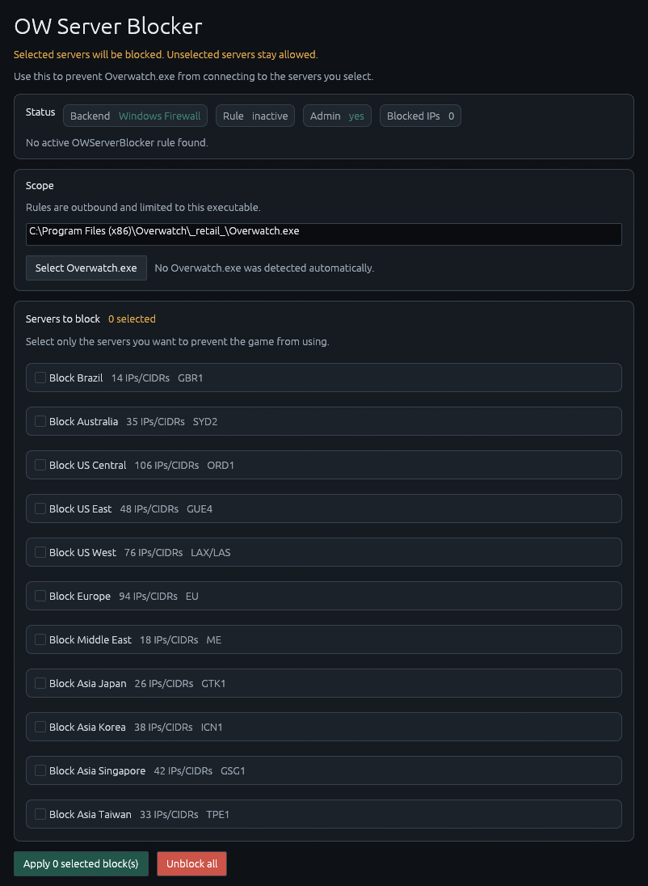

# OW Server Blocker

Simple Windows app for blocking selected Overwatch 2 server regions only for `Overwatch.exe`.

## How It Works

OW Server Blocker creates one outbound Windows Firewall rule named `OWServerBlocker - Overwatch.exe`.

The rule is scoped to the selected `Overwatch.exe` path and blocks only the server regions you select in the app. Changing the selection replaces the previous rule, so old blocks are not duplicated or left behind.

## How To Use

1. Download and extract the release zip.
2. Run `owsvblocker.exe` as administrator.
3. Click `Select Overwatch.exe` and choose your game executable.
4. Select the server regions you want to block.
5. Click `Apply selected block(s)`.

To remove every block created by the app, open it as administrator and click `Unblock all`.
